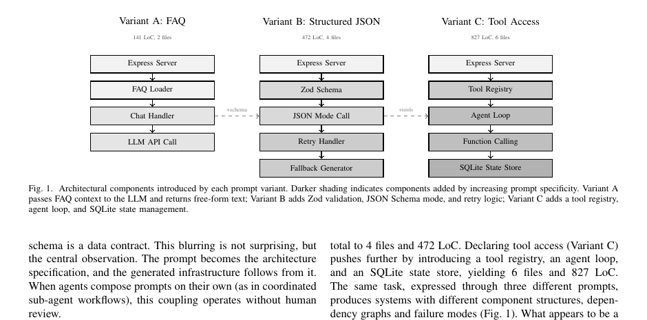

# Architecture Without Architects (vibe architecting)

**Prefer the paper.** Position paper on how coding agents make **implicit architectural decisions** (frameworks, stores, integrations) without review, and how prompt features couple to required infrastructure. Coins **vibe architecting**: architecture shaped by prompts rather than deliberate design.

## Key points

- **Five agent mechanisms** that choose architecture: model selection, task decomposition (module boundaries), default configuration, scaffolding/templates, and integration protocols (e.g. MCP).
- **Prompt–architecture coupling.** Same task, different prompt wording → structurally different systems (illustrated case study with Claude Code). Six recurring patterns (structured output, few-shot, function calling, ReAct, RAG, context reduction), labeled contingent vs fundamental.
- **Governance gap.** Agent decisions are fast, bundled, and opaque (no ADRs). Suggests prompt impact statements, ADRs for prompt/agent choices, complexity thresholds, and a three-layer constraints / conformance / knowledge framing.
- **Research agenda (rough):** cross-agent replication, architectural-footprint metrics, proactive impact tooling, **automated ADR generation from agent reasoning traces**, and pattern-composition analysis.

## Why it matters for this thesis

Directly frames [[architectural-reasoning-for-coding-agents]]: agents already decide architecture, but without recoverable rationale. Strengthens Direction 2 (planning/spec) and the ADR / reasoning-trace ideas ([[architecture-decision-record]], [[reasoning-traces-for-generated-code]]): if prompts and agent traces *are* the architecture record, they need to be captured and reviewed like ADRs.

## Links

- Paper (arXiv): https://arxiv.org/abs/2604.04990 · [PDF](https://arxiv.org/pdf/2604.04990)
- Case-study code: https://github.com/phomarkon/vibe-architecting-case-study
